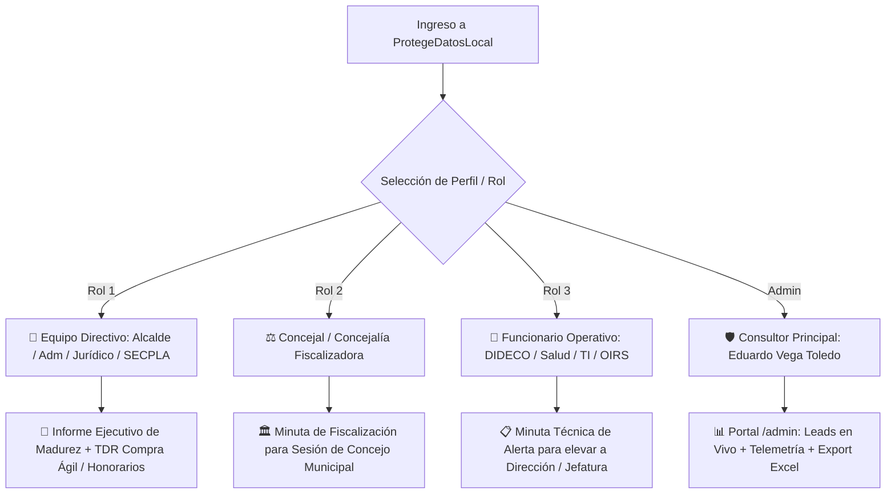

# PRODUCT REQUIREMENTS DOCUMENT (PRD)
## ProtegeDatosLocal — Suite de Autodiagnóstico, Gobernanza y Puesta al Día Ley N° 21.719
**Código de Proyecto:** P087 | **Portafolio:** P028 GovTech  
**Consultor Principal & Titular de Derechos:** Eduardo Vega Toledo (`evegat@uchile.cl`)  
**Versión:** 3.5.0-FINAL | **Fecha:** 23 de Agosto de 2026 | **Estado:** Aprobado para Implementación

---

## 1. 📌 Resumen Ejecutivo y Visión de Producto

### 1.1. Visión
Convertir a **ProtegeDatosLocal** en la plataforma de referencia y puerta de entrada (*Lead Magnet & Diagnostic Tool*) para la adecuación integral de los **345 municipios de Chile** a la **Ley N° 21.719 de Protección de Datos Personales**, cuya entrada en vigencia sin marcha blanca está fijada para el **1 de diciembre de 2026**.

### 1.2. Propuesta de Valor
Entregar a funcionarios, concejales y directivos municipales un **autodiagnóstico web gratuito, confidencial y sin almacenamiento en servidor (Zero-Storage)** que en 5 minutos genera:
1. Su **Índice de Madurez de Privacidad Municipal (IMM 0–100%)** y gráfico Radar de 7 dimensiones.
2. Detección de **top brechas críticas y brechas de capacitación**.
3. Un **documento ejecutivo formal adaptado al rol del usuario** (Informe para Alcaldía, Minuta de Fiscalización para el Concejo, o Minuta Interna para Jefaturas).
4. **Bases Técnicas y Términos de Referencia (TDR)** listos en Microsoft Word (`.doc`) para contratar el servicio de consultoría por **Compra Ágil (< 30 UTM)** o **Honorarios a Suma Alzada (Art. 4° Ley N° 18.883)** con valorización presupuestaria transparente.

---

## 2. 👥 Segmentación de Usuarios y Perfiles de Destino (User Personas)



| Perfil / Persona | Motivación Principal | Formato y Tono del Entregable | Mecanismo de Activación Comercial |
| :--- | :--- | :--- | :--- |
| **1. Directivo Municipal** (Alcaldía, Administrador, Jurídico, SECPLA, Control, DAF) | Tomar decisiones de compra inmediata, evitar sumarios de CGR y blindar contratos en Mercado Público. | **Informe Ejecutivo de Madurez (IMM)** + Semáforo de Riesgo Directivo + Bases Técnicas TDR en Word. | Ofrecimiento de Acompañamiento Técnico y emisión de Decreto Alcaldicio. |
| **2. Concejal / Concejalía** (Fiscalización Comunal - Art. 79/80 LOCM) | Fiscalizar el cumplimiento legal, advertir la exposición patrimonial y pedir soluciones en incidentes del Concejo. | **Minuta de Fiscalización y Riesgo Legal para el Concejo Municipal**. | Solicitud en Concejo para que la Alcaldía contrate la puesta al día. |
| **3. Funcionario "De a pie"** (Operadores DIDECO/RSH, CESFAM, Tránsito, TI) | Evitar sumarios individuales por manejo de datos sensibles (RSH/Fichas) y solicitar apoyo formal a su Jefatura. | **Minuta Interna de Diagnóstico y Propuesta de Mejora para Jefatura / Dirección**. | El funcionario eleva la minuta a su Director(a) recomendando la consultoría. |
| **4. Administrador / Consultor** (Eduardo Vega Toledo) | Monitorear en tiempo real los accesos comunales, leads generados y efectividad de canales de prospección. | **Portal Web `/admin`** con métricas en vivo, telemetría y exportación a Excel 1-clic. | Cierre comercial y seguimiento B2G directo. |

---

## 3. 🎯 Módulos y Requerimientos Funcionales

### MÓDULO 1: Autodiagnóstico Adaptativo y Motor IMM
* **Banco de Preguntas:** 25 preguntas ponderadas divididas en 7 dimensiones normativas (Gobernanza, RAT, Derechos ARSOPB, Seguridad/Brechas, EIPD, Proveedores/Mercado Público, y Salud/CESFAM).
* **Tratamiento Pedagógico de "No Sabe / No Responde":**
  - Identificador: `NO_SABEMOS`.
  - Puntuación: 0 puntos para rigor normativo.
  - **Visualización en Resultados:** Se destaca en **amarillo pedagógico** como *"Brecha de Inducción y Conocimiento Institucional"*, generando una alerta prioritaria que justifica la contratación de una **Jornada de Capacitación Ley 21.719**.
* **Visualización:** Gráfico de telaraña responsivo mediante `RadarChart.tsx` (SVG nativo).

### MÓDULO 2: Generador de Kits Legales y Términos de Referencia (KIT-01 al KIT-07)
* **Descarga en Microsoft Word (`.doc`):** Generación directa en el cliente con estilos corporativos (Calibri, tablas, membrete oficial, pie de página formal).
* **Catálogo de 7 Instrumentos:**
  1. **KIT-01:** Decreto Alcaldicio de Nombramiento de DPO y Comité de Privacidad (Arts. 14 y 48 Ley 21.719 / Ley 18.695).
  2. **KIT-02:** Anexo DPA de Encargado de Tratamiento para Licitaciones en Mercado Público (Art. 25 Ley 21.719 / Ley 19.886).
  3. **KIT-03:** Protocolo y Formato JSON de Notificación de Brechas de Seguridad en 72h (Art. 27 Ley 21.719 / Ley 21.663).
  4. **KIT-04:** Compromiso de Confidencialidad y Deber de Secreto RSH para DIDECO (Ley 19.949 / DS 160 / Ley 18.883).
  5. **KIT-05:** Pauta de Verificación y Auditoría Clínica DISAM/CESFAM (Ley 20.584 / Ley 21.719).
  6. **KIT-06:** TDR para Compra Ágil (< 30 UTM / Art. 10 bis DS 250 Hacienda).
  7. **KIT-07 (NUEVO):** **TDR para Contratación a Honorarios a Suma Alzada (HSA - Art. 4° Ley N° 18.883)** con valorización presupuestaria desglosada.

#### Desglose de Valorización Presupuestaria en KIT-07:
* **Monto Referencial:** **28 UTM (~$1.900.000 CLP bruto)**.
* **Plazo de Ejecución:** 30 días corridos.
* **Hitos de Pago:**
  - *Hito 1 (30% - ~$570.000 CLP):* Plan de Trabajo y Diagnóstico Preliminar de Brechas.
  - *Hito 2 (40% - ~$760.000 CLP):* Entrega del Registro RAT Municipal y Decretos de Gobernanza.
  - *Hito 3 (30% - ~$570.000 CLP):* Jornada de Capacitación a Funcionarios e Informe Final Visado.

### MÓDULO 3: Portal Privado de Administración (`/admin`)
* **Ruta:** `/admin` (Página Astro con componente React `AdminDashboard.tsx`).
* **Seguridad:** Acceso protegido por **PIN Maestro** con bloqueo temporal tras 5 intentos fallidos (Rate Limiting).
* **Métricas en Vivo:**
  - Contador de Visitas Totales y Diarias.
  - Total de Municipios Registrados.
  - Total de Informes Solicitados por Correo.
* **Tabla de Contactos en Tiempo Real:**
  - Columnas: `Fecha/Hora`, `Municipalidad`, `Funcionario`, `Cargo/Rol`, `Correo Institucional`, `Área Evaluada`, `Canal de Origen`.
  - Buscador y filtro instantáneo por nombre de comuna.
* **Exportación 1-Clic:** Botón para descargar la planilla consolidada en **Excel (`.xlsx`)** o **CSV** directamente en el navegador.

### MÓDULO 4: Telemetría Zero-Cookie y Atribución por Canal
* **Parámetros de Campaña:** Detección de `?src=email_juridico`, `?src=email_secpla`, `?src=linkedin`, `?src=whatsapp`, `?src=directo`.
* **Privacidad Estricta:** Registro agregado sin cookies de terceros, sin almacenar direcciones IP y 100% compatible con el Art. 13 de la Ley N° 21.719.
* **Backend:** `/api/telemetria.php` guarda los agregados en `~/pdl_secure_data/telemetria_resumen.json`.

---

## 4. 🔒 Requerimientos No Funcionales y Seguridad (S-SDLC)

1. **Arquitectura Zero-Storage en Evaluación:** Las respuestas de las 25 preguntas residen exclusivamente en la memoria local del navegador (`localStorage`) y nunca se envían al servidor.
2. **Almacenamiento Aislado:** Las trazas de contacto se almacenan fuera de la raíz web en `~/pdl_secure_data/` con permisos de sistema `0700`.
3. **Hardening HTTP (`.htaccess`):** Cabeceras `Content-Security-Policy`, `X-Frame-Options: DENY`, `X-Content-Type-Options: nosniff` y `HSTS`.
4. **Protección Anti-Bot:** Honeypot invisible sin costo y sin cookies.
5. **Rendimiento:** Carga inicial $< 1.0$s con Astro SSG y 0 kB de JavaScript en páginas estáticas.

---

## 5. 🚀 Arquitectura Técnica y Stack

```
[Cliente / Navegador]
  ├── Astro 5.x (Static Site Generation)
  ├── React 19 Islands (Wizard, Kits, Admin Dashboard)
  ├── Tailwind CSS 4.x (Diseño Institucional Azul Cobalto / Dark Mode)
  └── TypeScript Estricto (Modelos de Datos y Scoring Client-Side)
        │
[Microservicios Backend PHP 8.2 en Hostinger]
  ├── /api/registro-acceso.php (Honeypot + Rate Limit + SMTP)
  ├── /api/enviar-informe.php (Plantilla Corporativa HTML)
  ├── /api/telemetria.php (Conteo Zero-Cookie por Canal)
  └── /api/admin-data.php (Autenticación PIN + Entrega de Leads)
        │
[Almacenamiento Privado en Servidor]
  └── ~/pdl_secure_data/ (traza_accesos.log, telemetria_resumen.json)
```

---

## 6. 📅 Criterios de Aceptación y Plan de Pases

- [ ] **CA-01:** El formulario de inicio permite seleccionar entre los 3 roles (Directivo, Concejal, Funcionario de a pie) y el reporte adapta su título y estructura al rol elegido.
- [ ] **CA-02:** Marcar "No sabe" en preguntas no descuenta puntos de forma punitiva, sino que activa el banner de *Brecha de Inducción/Capacitación*.
- [ ] **CA-03:** El generador de kits incluye **KIT-07** con el TDR de Honorarios a Suma Alzada (Art. 4° Ley 18.883) y descarga en Word (`.doc`) con la valorización en 3 hitos.
- [ ] **CA-04:** La ruta `/admin` solicita PIN, muestra la tabla de leads en vivo y permite descargar el Excel con 1 solo clic.
- [ ] **CA-05:** El backend PHP registra las visitas por canal `src` sin cookies y muestra el resumen en `/admin`.
